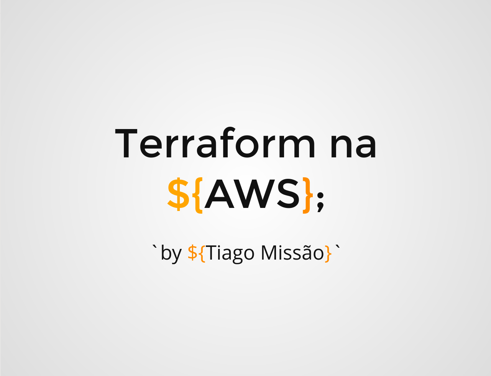

# WorkShop - Terraform na AWS

## **Tema**: Terraform na AWS : Entendendo os Conceitos Básicos na Prática !

## **Descrição**: Na cultura Devops tratar a infraestrutura como código é essencial ! Por isso, entenda na prática as principais vantagens que o Terraform tem a oferecer !

## **Slides**: [ Terraform na AWS](https://slides.com/tiagomissao/deck-2b7a5e/fullscreen)

---

---
Palestra apresentada no dia 13 de janeiro de 2021, na semana de inovação da Kroton/Cogna.